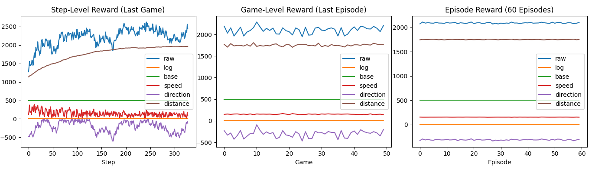

# Reward Priority Manager (RPM)

[中文文档 (Chinese Version)](README_cn.md)  | [Full Design Document](Document.md)

## Project Overview

Reward Priority Manager (RPM) is an innovative reward management system designed for reinforcement learning and complex decision-making systems. It addresses core issues in traditional reward engineering, such as difficulty in tuning reward weights and instability of reward signals, through a **hierarchical priority architecture** and **dynamic variable association** mechanism.

The core concept of RPM is to decompose the reward value into two dimensions: `rank` and `param`:

```
Final Reward = param × (base ^ rank)
```

This design allows high-priority rewards to naturally dominate lower-priority ones without manually adjusting weight coefficients.

## Key Features

1. **Hierarchical Priority Architecture**

   * Higher-rank rewards automatically override lower-rank rewards
   * Supports direct `rank/param` control or automatic decomposition from `value`
   * Configurable base (default is 10)

2. **Dynamic Variable Association**

   ```python
   # Speed reward: dynamically adjusted based on current speed
   mgr.add(3, 1.0, var=current_speed, max_var=max_speed, mul=1.5, name="speed")
   ```

3. **Multi-level Aggregation and Compression**

   ```mermaid
   graph TD
     A[Step-Level Reward] -->|50 steps| B[Game-Level Aggregation]
     B -->|50 games| C[Episode-Level Aggregation]
     C -->|60 episodes| D[Training Analysis]
   ```

4. **Dual Output Modes**

   * `raw`: raw reward value (preserves magnitude differences)
   * `log`: log-compressed value (suitable for neural network training)

## Installation and Usage

### Installation

```bash
git clone https://github.com/611711Dark/Reward_Manager_System.git
```

### Basic Usage

```python
from reward_system import RewardMgr

# Create a reward manager
mgr = RewardMgr(base=10)

# Add a fixed base reward
mgr.add_value(500.0, name="base")

# Add a dynamic speed reward (current speed 5.0, max speed 10.0)
mgr.add_value(1000.0, var=5.0, max_var=10.0, mul=1.5, name="speed")

print(f"Raw Reward: {mgr.total_raw():.1f}")  # Raw Reward: 1250.0
print(f"Log Reward: {mgr.total_log():.3f}")  # Log Reward: 5.575
print(f"Speed Component: {mgr['speed']:.1f}")  # Speed Component: 750.0
```

### Environment Integration

```python
from simple_env import SimpleNavigationEnv

env = SimpleNavigationEnv()
state = env.reset()

# Execute action and obtain reward
action = [0.5, 0.3]
next_state, reward, done = env.step(action, use_log_reward=True)
```

## Core Components

### 1. Reward (Atomic Reward)

```python
r = Reward(rank=2, param=1.5, base=10, name="critical")
print(r.raw)  # 1.5 * 10² = 150.0
print(r.log)  # 2.1789769472931693
```

### 2. RewardMgr (Reward Manager)

```python
mgr = RewardMgr()
mgr.add_value(200.0, name="bonus")  # Automatically decomposes rank/param
mgr.add(rank=1, param=3.0, name="penalty")  # Manually specify (recommended)

# Chain calls
mgr.add_value(500.0, name="base").add_value(-100.0, name="error")
```

### 3. RewardTrace (Reward Trace)

```python
trace = RewardTrace()

# Record multi-step rewards
for _ in range(10):
    mgr = env.calculate_reward()
    trace.push(mgr)

# Compress into a single RewardMgr
summary = trace.to_reward_mgr()
```

## Three-Level Monitoring System

### Demo Execution

```bash
python demo.py
```

### Visualization Output



1. **Step-Level Monitoring**

   * Detailed reward components of the last game
   * Includes both raw and log-compressed values

2. **Game-Level Monitoring**

   * Aggregation of 50 games in the last episode
   * Shows trend of each reward component

3. **Episode-Level Monitoring**

   * Trend over 60 training episodes
   * Helps identify long-term reward patterns

## Design Advantages

1. **Mathematical Interpretability**
   The reward formula = param × (base ^ rank) provides a clear mathematical foundation

2. **Dynamic Priority Assignment**

   ```python
   # Automatically compute appropriate rank
   rank = max(0, int(math.log10(abs(value)/base)) + 1)
   ```

3. **Memory Efficiency**

   * Uses `__slots__` to reduce memory usage
   * `deque` supports sliding window operations

4. **Multi-Level Analysis**

   ```python
   # Three-level data retention strategy
   if ep_idx == N_EPISODE - 1:
       final_game_trace = game_trace  # Retain final episode
   ```

## Application Scenarios

1. **Reinforcement Learning Systems**

   * Replace traditional scalar rewards
   * Address sparse reward issues

2. **Game AI Development**

   * Compose complex behavior rewards
   * Balance multiple objectives

3. **Robot Control**

   * Prioritize safety constraints
   * Fuse multi-sensor reward signals

## Contribution Guide

We welcome contributions via issues or pull requests:

1. Report bugs or suggestions
2. Add new environment examples
3. Extend visualization features
4. Optimize core algorithms

## License

This project is licensed under the [MIT License](LICENSE).

---
